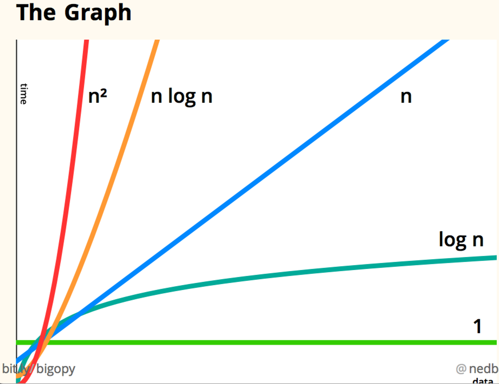

# Algorithmn

Set of instructions that perform one task.

*Recipe.*

> Each line in the code could be named as algorithm.
> 

# Binary Search

The Dictionary example: U could start to search the name of someone in the start
buut is better to start in the meddle and check if the starting letter is on the
left or right.

**The input is one sorted list/array.**

- If the element searched isn't in the list, the return is None;
- Each step reduce the pool of "to_seach" by half;
    
    To determinate the max steps to find the element it is need to make an log
    operation.
    

# Big-O Notation

Establish the worst possible hypothesis ⇒ the last item is found just on the
last step of the search.

## Algorithm complexity

*How fast an algorithm is and how it behaves when dealing with more elements.*

Ex.:

1.  A list of 100 elements:
    
    $log 100 = x$
    
    $2^x = 100$ → $2^6 = 64$  **&**  $2^7 = 128$
    
    **Thus Max Steps:**  $x = 7$
    
2. A list of 240k elements:
    
    $log 240k = x$
    
    $2^x = 240k$ → $2^17 = 131.072$  **&**  $2^ 18 = 262.144$
    
    **Thus Max Steps:**  $x = 18$
    

Lets take an 100 elements list. 

- In a Linear Execution it would take a max 100 steps to find the element.
- In a Binary Search it would take a max 7 steps to find the element.

Lets take an 4M elements list. 

- In a Linear Execution it would take a max 4M steps to find the element.
- In a Binary Search it would take a max 32 steps to find the element.

## The Growth of an Algorithm Complexity

| Elements | Linear  | Binary  |
| --- | --- | --- |
| 100 | 100ms | 7ms |
| 10,000 | 10s | 14ms |
| 1,000,000,000 | 11 days | 32ms |

Isn’t about how fast, but the complexity growth curve.

- O(n):  Linear;
- O(log n): Log;
    
    Ex.: Binary search.
    
- O(n * log n): Quick Sort Algorithm;
    
    Ex.: Quick sort.
    
- O(n^2): Slow Sort Algorithm;
    
    Ex.: Selection sort.
    
- O(n!):  just don’t.
    
    Ex.: Travelling Salesman.
    

<aside>
✅ The speed of an Algorithm isn’t mesure by the seconds it take to execute the
operation, but by the growth of the operation numbers;

How this Algorithm behave when the elements grow.

</aside>