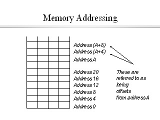

[Link to GitHub repo](https://github.com/egonschiele/grokking_algorithms)

# Memory address

Disponibilize an empty space to be used when necessary to store a item.

*To store more than one item you have two options: lists and arrays.*

# Array

Each item is stored in a **sequence** of memory addresses.

Each block is an empty space of memory;

To store 10 items you need 10 empty spaces side by side. Otherwise you’d need to relocate all the 10 items in the list to another memory address;

One way to avoid this problem is to prealocate the memory spaces that you need.

- Disadvantages:
    1. The prealocated spaces will be reserved even though they're empty;
    2. If you need more spaces you’ll have the same initial problem.

# Linked Lists

Each item is stored contais the memory address of the next element of the list.

<aside>
📌 Complexity of Lists and Arrays

|  | Arrays | Lists |
| --- | --- | --- |
| Read | O(1) | O(n) |
| Insert | O(n) | O(1) |
| Delete | O(n) | O(1) |

- **O(n):** Linear;
- **O(1):** Const.

OBS: The Array `insert` complexity O(n) is because every time a new element is added its necessary to check if the memory has enough address to fit all the elements. Otherwise all the items will be relocated.

OBS: The List `read` complexity O(n) is because you need to iter one by one util the specific item. If you want the tenth element, you need to pass all the previous nine.

*The List type of access is called Sequential access.*

- The Array type of access is the Random, each means that if you want the tenth element, you could go right way to the tenth.

**Array ⇒** excellent to read elements;

All the items in the array must be of the same type - str, int, bool…

**List ⇒** excellent to add and remove elements.

</aside>